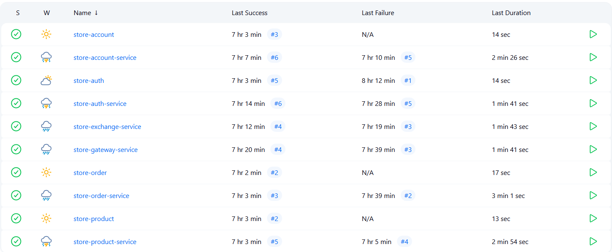

# Integração Contínua com Jenkins

O Jenkins foi utilizado neste projeto como ferramenta de automação para orquestrar pipelines de integração e entrega contínua (CI/CD), facilitando o gerenciamento de builds, testes e deploy dos microsserviços.

Embora não tenha sido realizado um deploy em provedor de nuvem como a AWS, a estrutura da pipeline está preparada para integração com ambientes como clusters Kubernetes locais (Minikube, por exemplo).

## Etapas da Pipeline

A automação implementada contempla as seguintes fases:

1. **SCM** — obtenção do código via Git.
2. **Dependencies** — preparação do ambiente e instalação de dependências.
3. **Build** — construção das imagens Docker para cada microsserviço.
4. **Push to Docker Hub** — envio das imagens construídas para o Docker Hub.
5. **Deploy to Kubernetes** — aplicação dos manifests no cluster local via `kubectl`.

## Organização do Projeto

Cada microsserviço possui seu próprio `Jenkinsfile`, permitindo pipelines independentes e customizadas por serviço. O repositório segue a seguinte organização de diretórios:

```bash
.
├── account-service
│   ├── Jenkinsfile
│   └── ...
```

## Acesso aos Jenkinsfiles

### Interfaces das APIs

\=== "Account"

```groovy
--8<-- "https://raw.githubusercontent.com/iancdesponds/store-account/refs/heads/main/Jenkinsfile"
```

\=== "Auth"

```groovy
--8<-- "https://raw.githubusercontent.com/iancdesponds/store-auth/refs/heads/main/Jenkinsfile"
```

\=== "Product"

```groovy
--8<-- "https://raw.githubusercontent.com/iancdesponds/store-product/refs/heads/main/Jenkinsfile"
```

\=== "Order"

```groovy
--8<-- "https://raw.githubusercontent.com/iancdesponds/store-order/refs/heads/main/Jenkinsfile"
```

### Implementações das APIs

\=== "Account Service"

```groovy
--8<-- "https://raw.githubusercontent.com/iancdesponds/store-account-service/refs/heads/main/Jenkinsfile"
```

\=== "Auth Service"

```groovy
--8<-- "https://raw.githubusercontent.com/iancdesponds/store-auth-service/refs/heads/main/Jenkinsfile"
```

\=== "Exchange Service"

```groovy
--8<-- "https://raw.githubusercontent.com/iancdesponds/store-exchange-service/refs/heads/main/Jenkinsfile"
```

\=== "Gateway Service"

```groovy
--8<-- "https://raw.githubusercontent.com/iancdesponds/store-gateway-service/refs/heads/main/Jenkinsfile"
```

\=== "Product Service"

```groovy
--8<-- "https://raw.githubusercontent.com/iancdesponds/store-product-service/refs/heads/main/Jenkinsfile"
```

\=== "Order Service"

```groovy
--8<-- "https://raw.githubusercontent.com/iancdesponds/store-order-service/refs/heads/main/Jenkinsfile"
```

## Jenkins com Todos os Serviços Rodando

